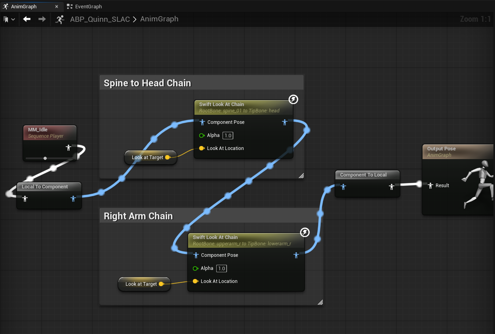
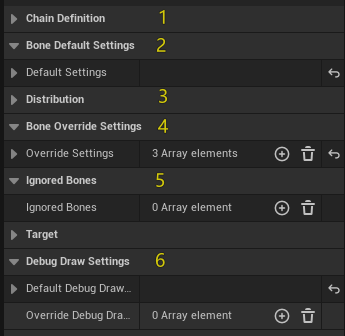
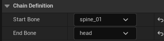
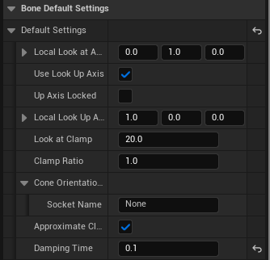
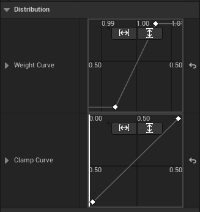
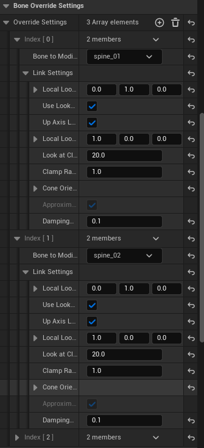
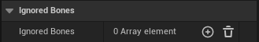
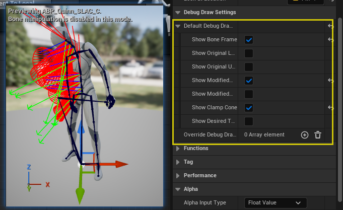

# Welcome to Swift Look At Chain Manual

## Overview

*[Swift Look At Chain](https://www.unrealengine.com/marketplace/slug/c3c3d72ef6de497ba9e166cf8c6974c6)* is an extended version built on top of *[Swift Look At](https://www.unrealengine.com/marketplace/slug/c3c3d72ef6de497ba9e166cf8c6974c6)*.
It introduces the ability to drive an entire bone chain with a single node, making editing more intuitive, convenient, and efficient.

---

## Features

* **Bone Chain Control**
Drive an entire bone chain with a single node.
* **Weight Curve Distribution**
The Weight Curve allows you to precisely control how much each bone in the chain contributes to the Look At effect.
* **Clamp Curve Distribution**
The Clamp Curve defines per-bone rotation limits along the chain.
* **Per-Bone Override Settings**
For specific bones where the default parameters are insufficient, Override Settings provide per-bone customization.

---

## Examples Project

<iframe width="560" height="315" src="https://www.youtube.com/embed/VQa51ICYKs4" frameborder="0" allowfullscreen></iframe>
* This demo video showcases the Swift Look At Chain plugin applied across various skeletal structures, including humanoid and dinosaur characters—covering head, spine, tail, and eye controls.
* Utilizing curve-driven weight adjustments, cone angle tuning, and axis hints, the plugin achieves smooth, natural look-at behaviors.
All scenes were recorded in real-time within a playable environment, with no post-editing, offering a transparent view of the plugin's performance in practical use cases.
* [Executable](https://1drv.ms/u/c/dc82dcbba351ac73/EVV9SC3G-E1ErM9-rtJr-Y0BbX6g-1fjV892cGqA6ltBJQ?e=8verZA)
* [Examples Project](https://github.com/Kontiki-Games/SwiftLookAtChainExamples)

---

## Quick Start Video

<iframe width="560" height="315" src="https://www.youtube.com/embed/VANI3xCpVXE" frameborder="0" allowfullscreen></iframe>

<iframe width="560" height="315" src="https://www.youtube.com/embed/NTAL2qabE2Y" frameborder="0" allowfullscreen></iframe>

---

## Node Setup

This section uses the humanoid character from the *Example Project* to demonstrate the **Swift Look At Chain** node.  
We start with an **AnimGraph overview**, then focus on the **Spine → Head** chain UI and walk through areas **1–6**.  
Insert the corresponding close-up screenshots for each area.

---

### Area 1｜Chain Definition
**Purpose:** Define the bone range driven by the chain.  
**Keys:**
- **Start Bone** (e.g., `spine_01`)
- **End Bone** (e.g., `head`)

The system collects all continuous bones between Start and End to form the chain.

---

### Area 2｜Default Bone Settings
**Purpose:** Provide a **single default behavior** for **all bones** in the chain. Any bone not explicitly overridden (Area 4) will use these defaults.

**Common fields (examples):**
- **Local Look At Axis**  
- **Use Look Up Axis / Up Axis Locked / Local Look Up Axis**  
- **Look At Clamp / Clamp Ratio / Approximate Clamp / Cone Orientation Socket**  
- **Damping Time** (seconds)

> Tip: Start with defaults. Only add overrides when a bone truly needs a different behavior.

---

### Area 3｜Curves / Distribution
**Purpose:** Distribute **influence** and **clamp intensity** along the chain using two curves:
- **Weight Curve** — how much each bone contributes (0–1)  
- **Clamp Curve** — how strong the angle limit is for each bone (0–1)

**Sampling & normalization (important):**
- Curves are **uniformly sampled by bone index** (from chain start to end).  
- After sampling, the **maximum value is normalized to 1.0**, and all other samples are scaled relative to it (including the max itself).  
- **Focus on the shape/trend** of the curve rather than absolute numbers.

---

### Area 4｜Override Settings (Optional)
**Purpose:** Provide **per-bone customization** when a specific bone requires behavior different from the defaults (e.g., axes, clamp, damping).

**Recommendations:**
- If defaults work, **don’t add overrides**.  
- Only create entries for bones that truly need different behavior.  
- If multiple bones share the same policy, duplicate the entry and change the bone name.

---

### Area 5｜Ignored Bones (Optional)
**Purpose:** Exclude bones that should **not** be processed by this chain (e.g., helper or special-purpose bones).

**Typical use cases:**
- Avoid conflicts when sharing control with physics or Control Rig  
- Reduce evaluation by excluding visual-only bones

---

### Area 6｜Debug Draw Settings
**Purpose:** Visualize the chain behavior in the viewport for development and teaching.

**Common toggles:**
- **Show Bone Frame**  
- **Show Original / Modified Look At Axis**  
- **Show Original / Modified Up Axis**  
- **Show Clamp Cone**  
- **Show Desired Target**

> Suggested for early tuning: enable **Clamp Cone**, and **Modified Axes**.

---

### Summary
- **Minimal setup:** Areas **1 (Chain)** + **2 (Defaults)** + **3 (Curves)** are usually sufficient for a natural result.  
- **Advanced control:** Use **Area 4 (Overrides)** only when specific bones require unique behavior.  
- **Debug efficiency:** Area **6 (Debug)** greatly improves iteration speed during development.

---

## Properties
### Runtime Node Properties
| Property              | Description                                                                                                                                               |
| --------------------- | --------------------------------------------------------------------------------------------------------------------------------------------------------- |
| **Start Bone**        | Name of the first bone in the chain. Defines where the chain begins.                                                                                      |
| **End Bone**          | Name of the last bone in the chain. Defines where the chain ends.                                                                                         |
| **Default Settings**  | Default parameters applied to all bones in the chain, unless explicitly overridden. Includes axis definitions, clamp, up axis settings, and damping.      |
| **Weight Curve**      | Curve controlling the influence weight of each bone in the chain. Sampled at equal intervals, normalized by the maximum value, and applied per bone.      |
| **Clamp Curve**       | Curve controlling the clamp angle of each bone in the chain. Sampled at equal intervals, normalized by the maximum value, and used to scale clamp angles. |
| **Look At Target**    | Target socket or bone to look at. Used if no explicit bone reference is provided. Supports offset via **Look At Location**.                               |
| **Look At Location**  | Target offset. If LookAtBone is empty, it is in world space; otherwise, it is relative to LookAtBone or LookAtSocket local space.                         |
| **Override Settings** | Per-bone override configuration. Bones listed here will use custom settings instead of the default chain configuration.                                   |
| **Ignored Bones**     | Bones excluded from the look-at rotation. Useful for skipping specific joints.                                                                            |

### Per-Bone Settings (FLookAtChainLinkSettings)
| Property                    | Description                                                                                                                              |
| --------------------------- | ---------------------------------------------------------------------------------------------------------------------------------------- |
| **Local Look At Axis**      | Axis in local space that should point toward the target.                                                                                 |
| **Use Look Up Axis**        | Whether to use an additional Up axis for stabilizing rotation.                                                                           |
| **Up Axis Locked**          | If enabled, locks the Up axis when `Use Look Up Axis` is active.                                                                         |
| **Local Look Up Axis**      | Defines the local Up axis direction when `Use Look Up Axis` is enabled.                                                                  |
| **Look At Clamp**           | Maximum look-at rotation in degrees. Rotation will be clamped within a cone.                                                             |
| **Clamp Ratio**             | Ratio between pitch and yaw constraints when clamping.                                                                                   |
| **Cone Orientation Socket** | Optional socket providing a rotation offset for the clamp cone’s central axis.                                                           |
| **Approximate Clamp**       | Optimization: available when Up Axis is enabled but not locked. Trades precision for better performance.                                 |
| **Damping Time**            | Damping time (seconds) for smoothing bone rotation. Smaller values = faster/snappier response; larger values = smoother/slower response. |

### Debug Properties

| Property | Description |
| --- | --- |
| **Default Debug Draw Settings** | Global default visualization settings applied to the entire chain. |
| **Override Debug Draw Settings** | Per-bone override visualization settings. Specific bones can have custom debug draw toggles, independent of the default. |
| **Show Bone Frame** | Display the local coordinate system axes of each bone. |
| **Show Original Look At Axis** | Display the bone’s original Look At axis before modification. |
| **Show Original Up Axis** | Display the bone’s original Up axis before modification. |
| **Show Modified Look At Axis** | Display the bone’s Look At axis after modification. |
| **Show Modified Up Axis** | Display the bone’s Up axis after modification. |
| **Show Clamp Cone** | Display the clamp cone used to limit rotation. |
| **Show Desired Target** | Display the final desired target position. |

